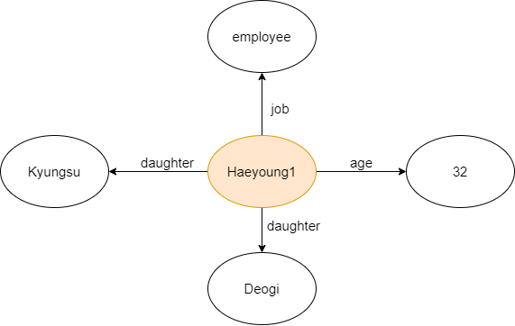
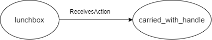
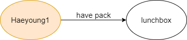
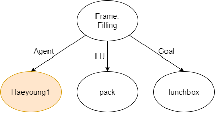

## Knowledge Graph

### Install pakages
```
> pip install https://github.com/explosion/spacy-models/releases/download/en_core_web_sm-2.2.0/en_core_web_sm-2.2.0.tar.gz --no-deps
> apt-get install default-jdk
````

Downloads [stanford-corenlp-4.0.0.zip](https://stanfordnlp.github.io/CoreNLP/history.html) and unzip the downloaded package in `data` folder.

### Setup

Downloads `input` directory from [this link](https://drive.google.com/drive/folders/1IhWn82lBD96vTj6nvjdsCQOdQabi255L) and unzip the downloaded file to `data/input`.

 Check if there are `data/input/edited_AnotherMissOh_Subtitle` and `data/input/AnotherMissOh_ESST-list.json`. 

 Run the following command: 

```
> ./run_setup.sh
```

 Check if there are `data/input/AnotherMissOh_Scene_Subtitle/AnotherMissOh_ep{01-18}.json`

### Configuration

`config/config.yaml` 파일을 통해 추출할 에피소드를 정할 수 있습니다.

`config.yaml`의 1번째 줄 `ep: &ep "01"`은 그래프를 추출할 에피소드를 명시합니다. (01 ~ 18)

예를 들어, 에피소드 13의 그래프를 출력을 원하신다면 1번째 줄을 `ep: &ep "13"`으로 설정하여야 합니다.

### Execute

```
> ./run_knowledge_graph.sh
```

### Graph

input path: `data/input/AnotherMissOh_Scene_Subtitle/AnotherMissOh_ep{01-18}.json`

output path: `data/output/ep{01-18}_graph.json`

#### Example

##### input 

```
Haeyoung1: I have to pack a lunchbox.
```

##### output
```
data/ouput/graphs/
```

- char_background

  

- common_sense

  

- triple

  

- frame

  


#### Graph in a json format
```
data/output/graph.json
```

- dictionary
  - key: scene id
  - value: scene graph
- scene graph : 
  - char_background
    - function
      - 사전 구축된 Knowledge base에서 scene 내에 등장하는 등장인물의 배경지식 추출.
  - triples
    - function
      - scene내의 발화를 [Stanford open IE](https://nlp.stanford.edu/software/openie.html)로 triple 추출.
  - frames
    - scene내의 발화를 [frameBERT](https://github.com/machinereading/frameBERT)로 추출한 [frame graph](https://framenet.icsi.berkeley.edu/fndrupal/WhatIsFrameNet)
    - form
      - frame - lu - args
        - frame: 추출된 frame type
        - lu: 추출된 frame의 trigger가 되는 lexical unit
        - args: frame의 arguments (frame elements)
  - common_sense
    - function
      - 사전 구축된 Knowledge base에서 추출된 triple element, frame element의 [ConceptNet](https://conceptnet.io/) 지식 추출.
  - entity_background
    - function
      - 사전 구축된 Knowledge base에서 추출된 triple element, frame element의  wiki 기반 지식(from Acryl) 추출.

#### Visualization

- path : `data/output/graphs`
- triples & char_background로 이루어진 그래프.
- frames로 이루어진 그래프.