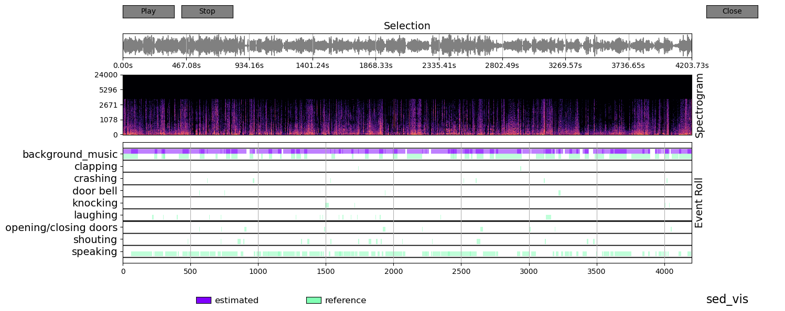

# Introduction
This repository contains source code in Pytorch of a simple sound event detection (multi-label classification) model using 1-d CNN.

# Requirements (requirements.txt)
* Python 3.6
* PyTorch 1.0.1
* Librosa 0.7.2
* Pydub 0.24
* [sed_vis](https://github.com/TUT-ARG/sed_vis)
* [dcase_utils](https://github.com/DCASE-REPO/dcase_util)

# Method 
## Data preprocessing
All the audio from the video dataset (`./sound_event_detection/data/AnotherMissOh_High/`) will be extracted to WAV format (`./sound_event_detection/wavs/`) at sampling rate 48000Hz. 

After that WAV files are preprocessed: divided into audio chunks according to the given ground truth annotations (`./sound_event_detection/data/AnotherMissOh_Sound/`) and saved to `./sound_event_detection/src/pre_proc/`.

Finally, sound features are extracted from each audio file (`./sound_event_detection/src/pre_proc/*`), split into train/test (80%/20%) sets, and saved to `./sound_event_detection/src/train.csv` and `sound_event_detection/src/test.csv`

>> ./scripts/preprocess_sound_event.sh
```
Note: all scripts are need to be run from the parent directory (`./drama-graph/`).
```

## Training the model
1-D CNN PyTorch model (`./sound_event_detection/src/models.model_torch`) with 4 CNN and 2 FC layers is trained for 300 epochs.

The trained model is saved in `./sound_event_detection/checkpoint/torch_model.pt`. 

>> ./scripts/train_sound_event.sh

## Evaluate the trained model:
To  evaluate the trained model on the provided data, run the following command:

>> ./scripts/eval_sound_event.sh
```
Testing metrics:
    accuracy:       62.720,
    avg. precision: 0.627,
    avg. recall:    0.627,
    avg. F1:        0.622.
```

The confusion matrix is saved to `./sound_event_detection/figures/confusion_matrix.png`.

## Inference on a single file and create its visualization
To inference or evaluate with a single audio file:
>> ./scripts/inference_sound_event.sh

sed_vis folder should be in the directory from which you run the file(`./`), so here the directory is (`drama-graph/sed_vis/`).

This script will display a window by matplotlib as the following figure:


## Result folder: predictions
Example of the result format 
```
{
    "file_name": "AnotherMissOh02.wav",    //Name of the prediction file containing the episode number 
    "sound_results": [
        {
        "start_time": 296,                 // Start time at milliseconds, in the original annotation was hh:mm:ss 
        "end_time": 30270,                 // End time at milliseconds
        "sound_type": "background_music"   // Label 
        },
        ...
        ]
}
```
